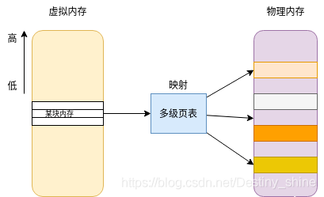
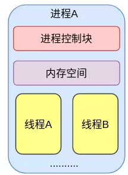
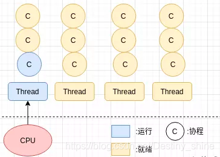
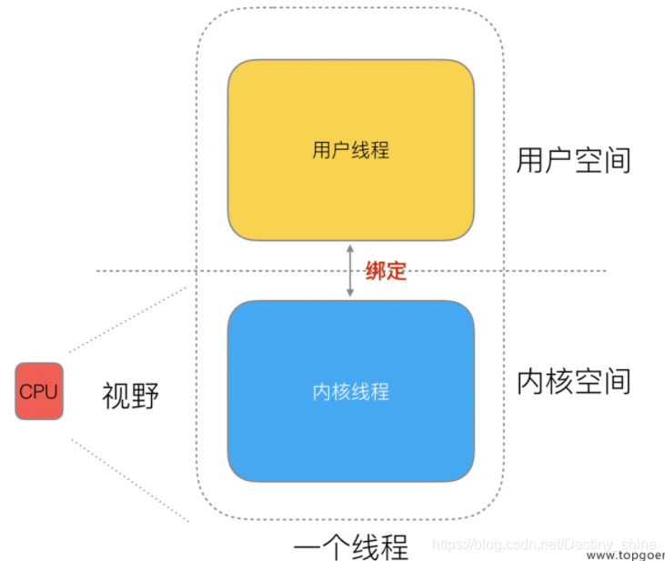
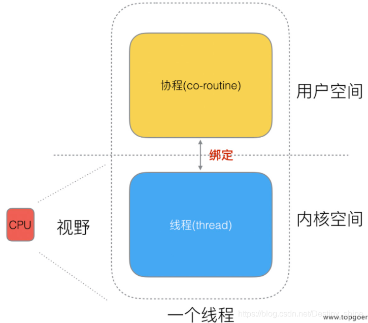
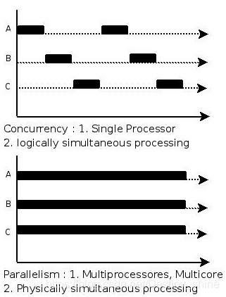
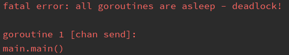
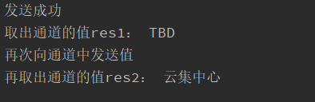

# Golang 并发编程


##  1. 进程、线程、协程、并发、并行
### 1.1 进程、线程、协程
#### 1.1.1 进程:
对操作系统来说，进程是资源分配的最小单位，程序启动时，操作系统就会给这个程序分配一块内存空间，对于程序本身而言它认为这是一整块连续的内存空间，称为虚拟内存空间，而实际上落实到操作系统内核时通常是一块块的内存碎片。一个进程大小可能是几个G，进程之间切换开销较大，进程可以实现操作系统的并发。



这片虚拟内存空间，可以划分为内核空间和用户空间，它们相互隔离，程序即使崩溃了，内核空间也不会受到影响。进程运行在内核空间时称为内核态，运行在用户空间称之为用户态。内核空间用于执行内核代码，用户空间只用于执行用户程序，若要执行各种IO操作，就需要通过系统调用等方式从用户态切换到内核态进入内核空间进行操作。

**多进程并发有两个缺点** ：一是内核的管理成本高，二是无法简单通过内存同步数据，进程间通信较困难。因此，多线程模式出现了。

#### 1.1.2 线程:
对操作系统来说，**线程是资源调度的最小单位，**线程是进程的一个执行单元，一个进程至少需要包含一个线程（可以包含多个），只有拥有了线程的进程才会被CPU执行。一个线程大小约是几M。线程可以实现进程内部的并发。总结起来就是：**进程主要面向内存的分配管理，线程主要面向CPU的调度。**



一个进程下的多个线程是共享这个进程的内存空间的，即线程没有自己独立的内存空间。正因如此，所以一个线程可以读、写甚至清除另一个线程的堆栈。相当于线程之间是没有保护的。但每个线程都有自己的堆栈、程序计数器、寄存器等信息，这些都不是共享的。线程也被称为轻量级进程，与进程调度类似，CPU在线程之间快速切换，就有了线程并行运行的假象。线程间的切换开销要比进程间切换小的多，因为不需要切换页表，虚拟地址空间等等一些东西。

共享地址空间可以方便的共享对象，但也有一个问题，就是任何一个线程崩溃，进程中所有线程会一起崩溃。

同时，多线程虽然进一步提高了并发，但在当今互联网高并发场景下，为每个任务都创建一个线程甚至是创建上万个线程来工作是不现实的，因为会消耗大量的内存，而且多线程开发要考虑很多同步竞争等问题，如锁、竞争冲突等。此外，**不管是进程还是线程，它们的切换都是由内核控制的，所以线程的切换涉及到用户空间和内核空间的切换（特权模式的切换），然后需要操作系统的调度模块完成线程调度。**

#### 1.1.3 携程:
高并发的情况如何更好的提高CPU的利用率呢？于是协程就出现了。如一个进程可包含多个线程，一个线程也可以包含多个协程。一个协程的大小约是几KB。



线程可以分为 “内核态 “线程和” 用户态 “线程。一个 “用户态线程” 必须要绑定一个 “内核态线程”，但是 CPU 并不知道有 “用户态线程” 的存在，它只知道它运行的是一个 “内核态线程”。



然后再细化分类一下，内核线程还叫 “线程 (thread)”，用户线程叫 “协程 (co-routine)”。



协程它不像线程和进程那样需要进行系统内核上的上下文切换（协程切换不涉及特权模式的切换），协程切换只涉及基本的CPU上下文切换，完全在用户空间完成，做的事要比进程线程少，因此切换开销要更小。

协程的优点：一是可以提高CPU利用率，避免系统内核级的线程间频繁切换造成的资源浪费；二是可以节约内存，一个进程几G、一个线程几M、一个协程几KB；三是稳定性好一些，线程可以通过内存共享数据，但是一个线程挂了，进程中所有线程会一起崩溃。


协程缺点：协程本质是个单线程，它不能同时使用单个 CPU 的多个核；一旦协程出现阻塞，将会阻塞整个线程。

### 2 并发和并行
#### 2.1 并发：

宏观上的“并行”，看起来两个程序A和B在同时运行，但是微观来看其实两个程序的指令是交织着运行的，即运行一会A在运行一会B，通过切换时间片往复交替。（并发就是你有处理多个任务的能力，但不一定同时）

#### 2.2 并行：
严格意义的同时执行。例如A和B两个程序分别运行在两个不同的cpu核上，它们互不影响。（并行就是你有同时处理多个任务的能力）

可以结合下面图片来理解并发和并行：



## 2. Goroutine

goroutine 是 Golang 并发的核心。**一个 goroutine 本质上是一个协程**（其与协程的具体区别下面介绍），Go 内部帮你实现了 goroutine 之间的内存共享。执行 goroutine 只需极少的栈内存(大概4~5KB，也可按需增大和缩小)。正因如此，golang 中同时运行成千上万个并发任务也是可以的。

**如何使用 goroutine？**

在并发编程过程中，我们通常希望将一个过程拆分成几块，然后每个 goruntine 负责其中一块。其实，当一个 go 程序启动时，主函数就是在一个单独的 goroutine 上运行的，可以称其为 main goroutine。如果需要其他 goroutine 去干别的事，那就可以用 go 语句来创建。golang 中只需要在调用函数的时候在前面加上go关键字，就可以为这个函数创建一个 goroutine 了。开发⼈员则无需了解任何执⾏细节，只需要定义多个任务，让系统去帮我们把这些任务分配到CPU上实现并发执行即可。

```golang
func hello() {
    fmt.Println("New Goroutine!")
}
func main() {
    hello()
    fmt.Println("main goroutine done!")
}
```


接下来在 hello 函数前面加上关键字 go，相当于启动一个 goroutine 去执行这个函数。
```golang
func hello() {
    fmt.Println("New Goroutine!")
}
func main() {
    go hello()
    fmt.Println("main goroutine done!")
}
```


可以看到结果只打印了 main goroutine done!，没打印 New Goroutine!。什么原因呢？

这是因为 go 程序启动时就会为 main() 函数创建一个默认的 goroutine。当 main() 函数返回的时候该 goroutine 就结束了，所有在 main() 函数中启动的 goroutine 也会跟着一起结束。

因此要让 main 函数等一等 hello 函数，可以使用 time.Sleep。
```golang
func hello() {
    fmt.Println("New Goroutine!")
}
func main() {
    go hello()
    fmt.Println("main goroutine done!")
    time.Sleep(time.Second)  //等待1秒
}
```


从以上结果可以看到先打印 main goroutine done!，然后打印 New Goroutine!。这是因为创建新的 goroutine 需要花一些时间，而此时 main 函数的 goroutine 是一直在执行的。
 

**启动多个 goroutine**
```golang
var m int
 
func add() {
    m++
}
 
func main() {
    m = 0
    for i:=0;i<1000;i++ {
        go add()
    }
    fmt.Println("并发执行执行1000次++操作后的m：",m)
 
 
    m = 0
    for i:=0;i<1000;i++ {
        add()
    }
    fmt.Println("顺序执行执行1000次++操作后的m：",m)
    time.Sleep(time.Second)
}
```


从上面结果可以看出并发执行后的结果小于1000，这是因为我们启动了多个 goroutine 去并发执行 add 函数，当 m 等于某一个值时，可能有 n 个 goroutine 读到了相同的m值，此时相当于这n个goroutine 同时对 m 变量做了一次加操作（顺序执行的话就是做了n次加操作）。

 
**主函数的goroutine退出后，其它的goroutine也会自动退出**

```golang
func main() {
    go func() {
        i := 0
        for {
            i++
            fmt.Printf("new goroutine: i = %d\n", i)
            time.Sleep(time.Second)
        }
    }()   //匿名函数后加()是运行这个函数的意思
 
    i := 0
    for {
        i++
        fmt.Printf("main goroutine: i = %d\n", i)
        time.Sleep(time.Second)
        if i == 2 {
            break
        }
    }
}
```


**goroutine和协程的区别**
goroutine 的本质是协程。但与协程不同的是，goroutine 不完全是用户控制，一定程度上由 go 运行时（runtime）管理，好处是：当某 goroutine 阻塞时，会让出 CPU 给其他 goroutine。

## 3. 锁机制

当启动多个 goroutine 并同时操作同一个资源时会发生竞态问题（数据竞态）。

**何为竞态**：当多个线程竞争同一个资源时，如果对资源的访问顺序敏感，就称存在竞态条件。导致竞态条件发生的代码区称作临界区。数据竞态问题会导致计算结果不可预期。

**如何解决**：加锁。共享资源在同一时间只能由一个线程访问（加锁），其他线程想要访问必须等当前线程访问完释放锁。

举一个**不加锁**的例子：
```golang
var x int64
var wg sync.WaitGroup  //使用sync.WaitGroup来实现goroutine的同步
 
func add() {
    for i := 0; i < 5000; i++ {
        x = x + 1
    }
    wg.Done()   // goroutine结束计数-1
}
func main() {
    wg.Add(2)    // 启动一个goroutine计数+1
    go add()
    go add()
    wg.Wait()      // 等待所有goroutine都结束
    fmt.Println("运行后x的值是：", x)
}
```

上面例子开启了两个 goroutine 去累加变量 x，这两个 goroutine 在读取和修改 x 变量时会存在数据竞争，导致最后的结果与期待的不符。多次执行结果都不同。

### 1. 互斥锁mutex

它能够保证同时只有一个 goroutine 可以访问共享资源。Golang 中可以使用 sync 包的 Mutex 来实现互斥锁。修改上面的例子：

```golang
var x int64
var wg sync.WaitGroup  //使用sync.WaitGroup来实现goroutine的同步
var lock sync.Mutex
 
func add() {
    for i := 0; i < 5000; i++ {
        lock.Lock()  //加锁
        x = x + 1
        lock.Unlock()  //解锁
    }
    wg.Done()   // goroutine结束计数-1
}
func main() {
    wg.Add(2)    // 启动一个goroutine计数+1
    go add()
    go add()
    wg.Wait()      // 等待所有goroutine都结束
    fmt.Println("运行后x的值是：", x)
}
```


互斥锁能保证同一时间有且只有一个 goroutine 进入临界区，其他的 goroutine 都在等待锁；当互斥锁释放后，等待的 goroutine 才能获取锁然后进入临界区，唤醒多个同时等待的 goroutine 的策略是随机的。

### 2. 读写锁

不同于互斥锁的完全互斥，**读写锁比较适用于读多写少的场景**，当并发的去读取一个资源无需对资源修改时是没有必要加锁的，此时读写锁是更好的选择。

**读写锁的特点：**

读锁定时，一个 goroutine 获得了读锁，其他 goroutine 还可以继续获得读锁，但是无法获得写锁
写锁定时，一个 goroutine 获得了写锁，其他 goroutine 此时既不能获得读锁，也不能获得写锁
对未被读锁定的读写锁进行读解锁，会引发 Panic
对未被写锁定的读写锁惊醒写解锁，会引发 Panic
举例：

```golang
var (
    wg sync.WaitGroup
    rwMutex sync.RWMutex
    )
 
func main() {
    wg.Add(20)
 
    Data := 0
    for i := 0; i < 10; i++ {
        go func() {
            rwMutex.RLock()     //读加锁
            defer rwMutex.RUnlock()  //读解锁
            fmt.Printf("Read data: %v\n", Data)
            wg.Done()
            time.Sleep(2 * time.Second)
            // 这句代码第一次运行后，读解锁。
            // 循环到第二个时，读锁定后，这个goroutine不会被阻塞，同时读成功。
        }()
 
        go func(t int) {
            rwMutex.Lock()    //写加锁
            defer rwMutex.Unlock()  //写解锁
            Data += t
            fmt.Printf("Write Data: %v %d \n", Data, t)
            wg.Done()
            // 这句代码让写锁的效果显示出来，写锁定下需要解锁后才能写
            time.Sleep(2 * time.Second)
        }(i)
 
    }
    time.Sleep(5 * time.Second)
    wg.Wait()
}
```

运行结果：

```golang
Read data: 0
Write Data: 2 2
Read data: 2
Read data: 2
Read data: 2
Read data: 2
Read data: 2
Read data: 2
Read data: 2
Read data: 2
Read data: 2
Write Data: 3 1
Write Data: 7 4
Write Data: 10 3
Write Data: 15 5
Write Data: 15 0
Write Data: 22 7
Write Data: 28 6
Write Data: 36 8
Write Data: 45 9
```
通过结果可以看出读锁定后还可以继续获取读锁，但是写锁同一时间只能有一个goroutine获得。

### 3. sync.WaitGroup

Golang 中可以使用 sync.WaitGroup 来实现并发任务的同步，这比在代码中使用 time.Sleep 要灵活的多。 sync.WaitGroup 有下面的方法：


sync.WaitGroup 内部维护一个计数器，当启动 n 个 goroutine 时，可以通过 Add 方法将计数器加 n，当一个 goroutine 任务结束时可以通过 Done 方法将计数器减一，最后通过 Wait() 方法等待并发任务全部执行完，当计数器值为0时，表示所有并发任务已完成。

## 管道channel

函数在并发执行时有时需要在并发的函数之间传递数据，通常可以通过共享内存来实现，但是这种方式在不同的 goroutine 中容易发生竞态问题，要保证数据准确性就需要加锁，但是加锁又会使性能下降。golang 中提倡使用通信来共享内存而不是通过共享内存来实现通信，管道（channel）就是 golang 中不同的 goroutine 用来通信的机制，它能够保证在同一时间只有一个 goroutine 才能访问里面的数据。channel 是引用类型，它像一个队列，总是遵循先入先出的规则，这样能够保证收发数据的顺序。每一个 channel 都是一个具体类型的导管，即声明 channel 时需要为其指定元素类型。

### 1. channel 的声明和创建

声明格式：var 通道名称 chan 通道类型
```golang
var ch1 chan int      // 传递整型的通道
var ch2 chan string   // 传递字符串的通道
var ch3 chan []int // 传递int切片的通道
```

由于 channel 是引用类型，因此声明完之后需要使用 make 函数进行初始化，否则无法使用。channel 的创建格式：

make(chan 元素类型, [缓冲大小]) ，其中缓冲的大小是可选的。

举例：
```golang
var ch1 chan int   //声明
ch1 = make(chan int)  //初始化
 
ch2 := make(chan string)  //声明加初始化简写
```
### 2. channel 的操作

channel有发送、接收、关闭三种操作。

```golang
ch1 := make(chan int) //初始化一个通道
ch1 <- 66     //发送：将值66发送到通道中
res := <- ch1 //接收：从通道中取出值并赋值给变量res
<- ch1        //接收：接收通道的值但忽略结果
close(ch1)    //关闭：关闭通道
```

注意：只有在通知接收方 goroutine 所有数据都发送完成时才需要关闭通道**。通道可以被垃圾回收机制回收，它与文件关闭不同，操作结束后关闭文件是必须做的，但关闭通道不是必须。

- 关闭后的channel有以下特点：
- 对关闭的channel再进行关闭操作或引发panic
- 对关闭的channel发送数据会引发panic
- 对关闭的channel进行接收会一直获取值直到channel为空
- 对关闭的且已没有值的channel再获取值会得到对应类型的零值

### 3. 无缓冲通道

无缓冲通道又称阻塞通道。

```golang
func main() {
    ch1 := make(chan int) //初始化一个通道
    ch1 <- 66     //将值66发送到通道中
    fmt.Println("发送成功")
}
```



上述代码运行后会出现 deadlock 错误，这是因为使用 ch1 := make(chan int) 创建的是无缓冲通道，说白了就是无缓冲通道不能存值，只有在有接收者的时候才能通过这个通道发送值。

上面的代码会在ch <- 66这一行阻塞形成死锁，那如何解决？

一种方法是可以启用一个 goroutine 去接收值，

举例：
```golang
var ch chan string
 
func consume()  {
    res := <- ch
    fmt.Println("接收成功",res)
}
 
func main() {
    ch = make(chan string)
    go consume() //启动一个goroutine去接收值
    ch <- "TBD"
    fmt.Println("发送成功")
}
```


无缓冲通道上的发送操作会一致阻塞直到有一个 goroutine 在该通道上执行接收操作，这时才能发送成功，然后两个 goroutine 继续执行。相反，如果先执行接收操作，接收方的 goroutine 会被阻塞，直到另一个 goroutine 在该通道上发送一个值。

**ps**：无缓冲通道也被称为同步通道，因为使用其进行通信会使得发送和接收的 goroutine 同步化。

### 4. 有缓冲通道

解决上面 deadlock 错误的另一个方式是使用有缓冲通道。说白了就是有缓冲通道能存值，能存多少容量你自己定，但是往里存的值不能超过设定的容量。

```golang
var ch chan string
 
func main() {
    ch = make(chan string,1)   //通道容量设置为1
    ch <- "TBD"
    //ch <- "云集中心"    //此时会报错deadlock   因为通道满了装不下了（已经装了TBD这个值）
    fmt.Println("发送成功")
}
```

只有把通道中的值取走之后才能继续向里面发送值：

```golang
var ch chan string
 
func main() {
    ch = make(chan string,1)
    ch <- "TBD"
    fmt.Println("发送成功")
    res1 := <- ch
    fmt.Println("取出通道的值res1：", res1)
    fmt.Println("再次向通道中发送值")
    ch <- "云集中心"
    res2 := <-ch
    fmt.Println("再取出通道的值res2：", res2)
}
```



### 5. 如何判断通道是否已经关闭并从中取值

当通道关闭后再往通道发送值会引发panic。那如何判断一个通道是否关闭并且能够优雅的从通道中取值呢？

```golang
func main() {
    ch1 := make(chan int)
    ch2 := make(chan int)
 
    //开启一个goroutine将1~20发送到通道ch1中
    go func() {
        for i:=1;i<=20;i++ {
            ch1 <- i
        }
        close(ch1)
    }()
 
    //开启一个goroutine从通道ch1中取出值，并将每一个值的平方发送到通道ch2中
    go func() {
        for {
            val,ok := <-ch1  //从通道中取值，通道关闭后在获取值ok=false
            if !ok {
                break
            }
            ch2 <- val*val
        }
        close(ch2)
    }()
 
    //在主goroutine中从ch2中接收值
    for val := range ch2 {
        fmt.Println(val)
    }
}
```

```golang
1
9
4
16
36
25
49
64
81
100
121
144
196
225
169
256
324
289
361
400
```

上述例子中展示了两种方式在接收值的时候判断 channel 是否被关闭，通常使用的是 for range 方式。

---

> 作者: [songlin](https://iiweb.cn)  
> URL: https://fixit.lruihao.cn/2023-02-10-go-concurrency/  
> 转载 URL: https://blog.csdn.net/Destiny_shine/article/details/119104624
